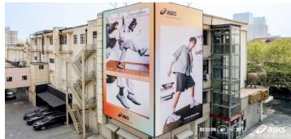
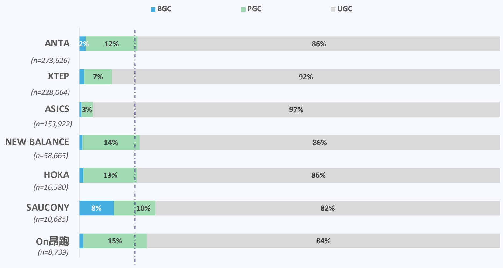
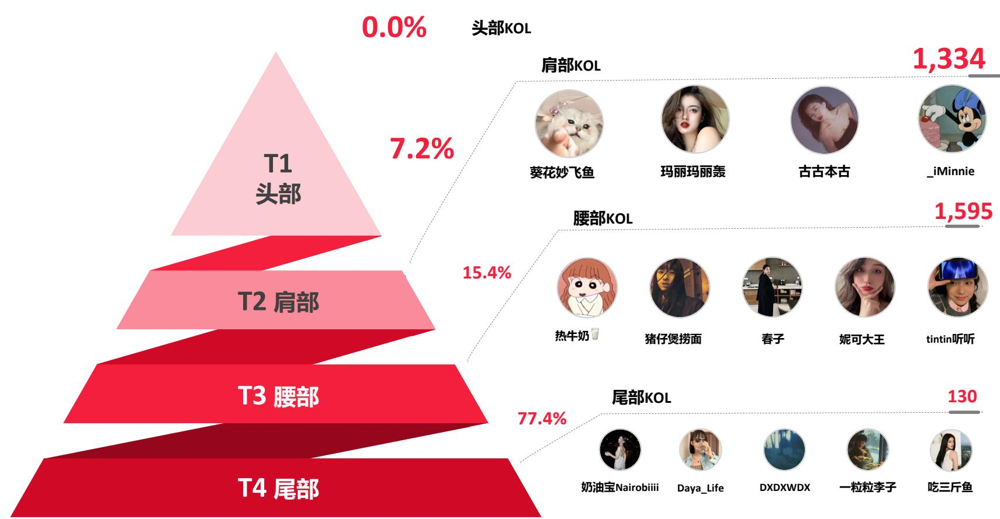
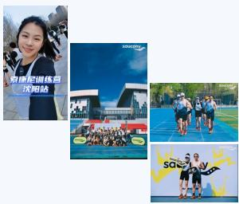
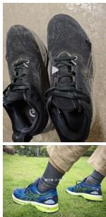

# ASICS Social Listening Report

April 2025

# PART

APR-25 ASICS与竞争品牌社媒表现总览

# ASICS 4月\*社媒表现SCORECARD

DATA SCOPE: 2025/3/25 – 2025/4/24注：自4月起，月数据范围调整为上月25日至当月24日

# 核心指标

声量 153,922 -1.57M Rank #3 in Total 7 ↓2

互动量 1.34M -5.56M Rank #4 in Total 7 - ↓1

情感表现 (UGC NSR) 90.3 -6.3 Rank #4 in Total 7 ↓3

# 分类拆解

# ASICS 4月声量出现明显波动，波峰由EDGE ENGAGING展览活动带来，活动期后声量下降，趋于平稳；此前官宣品牌大使田嘉瑞余热延续，本月活动中品牌顺势而为，借助粉丝生态的影响力，推高活动关注度

  
dasics   
ASICS 4月社媒表现趋势

  
ASICS社媒传播词云

# 明星效应

n 品牌大使田嘉瑞的声量占比约 $83 \%$

# 品牌活动

# 4.7 声量高峰

「EDGE ENGAGING」主题展览的声量占比约 $11 \%$

# 4.10 声量高峰

# 4.10-4.11 互动量高峰

# Edge Engaging主题展览预热

@ASICS亚瑟士官方账号携手品牌大使田嘉瑞发布 「EDGE ENGAGING」 线下主题展览预热短片

# 品牌活动图集和活动视频

@田嘉瑞出席ASICS品牌活动，时尚博主及超话大粉发布活动图集和活动视频  
link1 link2

# Edge Engaging主题展览开启

@田嘉瑞与@ASICS亚瑟士官方账号发帖分享「EDGE ENGAGING」主题展览，超话大粉持续转发，明星效应带动活动热度  
link1 link2

“#田嘉瑞空降巨鹿路758# @田嘉瑞6 穿 GEL-DS TRAINER14炸场ASICS主题展！ 复 古拼接鞋面+金属光影，走路带风诠释 「随机敢应」--不确定的世界，就用 自洽步伐破局！"link

“一起共赴 「EDGE ENGAGING」 线下主题展览送花花[送花花[送花花#田嘉瑞亚瑟士品牌大使官宣##asics亚瑟士品牌大使田嘉瑞link

“感谢@ASICS亚瑟士的邀请,来到ASICS亚 瑟士「EDGE,ENGAGING」主题展览见证 潮流表达与先锋艺术的大胆碰撞！"link

# 4月社媒指标概览

↑2 声量 监测品牌中位列#1 互动量 监测品牌中位列#1 情感表现 监测品牌中位列 #3 -

# 4月营销动作总结

新品发布 重要产品条线锋芒、 冠军乘风和旅步相继推出代际更新，产品传播上均突出其科技含量（氮科技、TPU材质等）和性能表现（减震、缓震等），彰显应对各自运动场景的专业性

体育资产 林孝埈和三人篮球国家队的签约，在扩充体育明星资产的同时或暗藏品牌对未来运动赛道侧重性上的考量

# 4月消费者口碑摘要

正面反馈分析 ANTA本月收购狼爪的行动整体收获称赞，代言人粉丝也持续活跃于社媒；产品端马赫系列一骑当先实战性能受到追捧

负面反馈分析 部分网友担忧ANTA的收购行为会对狼爪的品质及价格产生消极影响，同时一些消费者反馈安踏的部分核心产品性价比不高（C202、KAI等)

l ANTA 4月社媒整体表现维持高水准，声量和互动量均较上月提升较多，排名均重归榜首；BGC和PGC占比略有下降，但两者绝对值仍大幅领先l ANTA推进各产品条线的更新换代，传播上突出科技含量与性能表现；同时，通过签约速滑和篮球运动员/队伍进一步扩充其体育明星阵容l ANTA消费者对马赫系列的关注更胜往日，王一博和樊振东粉丝持续活跃，而品牌对狼爪的收购引发一定关切

# 正面反馈

负面反馈

<table><tr><td></td><td>赞赏品牌 收购行动</td><td>&quot;#安踏拟2.9亿美元收购狼爪#中国安踏做大做强，没烦恼&quot; “安踏现在绝对是顶流！好多你熟悉的牌子其实都是安踏的”</td></tr><tr><td>■</td><td>明星效应</td><td>&quot;安踏王一博四周年特别配色杰特别版真的太好看啦！宝子们快冲呀” “东哥牛恭喜安踏！//安踏投的朋友圈广告被评为2024年度最受欢迎广告 top2主题为“灵龙相伴圆梦巴黎”非常牛的国民好感度&quot;</td></tr><tr><td></td><td>马赫系列 (实战性能)</td><td>“体考倒计时！这双跑鞋让我PB直接提升10秒！&quot; ”最近晨跑试了这套速干套装+马赫5跑鞋真正感受到什么叫跑得快还轻松“</td></tr></table>

质疑品牌收购行动

“狼爪马上就开始被炒价格了汗，安踏就这德行，收购谁，谁开始涨价炒  
市场"  
“狼爪将会成又贵又不好看的品牌 ”

# 性价比不高

“安踏C202心跳卖这么贵，你是疯了吧！”“心跳不值得拥有了，价格太高了#安踏C202““你安踏就安踏非要出个欧文系列，多个标就贵一倍"“狂潮5pro情人节配色补货了，价格也是背刺了突然想到是因为贵好看还是因为本身就好看

# 竞品4月社媒表现观察 -

# 4月社媒指标概览

声量 监测品牌中位列#2  
互动量 监测品牌中位列#2  
情感表现 监测品牌中位列 #1 ↑3

l XTEP 4月社媒整体表现优秀，BGC运营和PGC投放均显著发力（两者占比较3月涨幅巨大），一定程度上也带动了UGC情感表现的大幅提升

# 4月营销动作总结

品牌活动 联合学体联于全国各地中学开展的「校园健康跑」活动贯穿整月，清北高校校跑活动赞助穿插其中，体现了品牌对青少年和大学生市场营销投入的重视

赛事赞助 赞助多项全球和国内田径跑步赛事，进一步塑造品牌专业运动形象时尚秀场 国际时装周的亮相或是品牌探寻向上路径、拔高调性的一次尝试

l XTEP在延续高频赛事赞助策略的同时，将线下品牌营销的视线投向青少年和大学生群体，品牌活动惠及全国各地知名中学和清北两大高校

# #1【时尚秀场】

4.3 AW25领 「速」 运动浪潮概念秀亮相中国国际时装周link

# #2【品牌活动】

4月特步×学体联「校园健康跑」活动先后登陆杭州学军中学（4.10）、川师附属青台山中学（4.15）、济南稼轩学校（4.19）、东北师大附中（4.22）、长沙市长郡中学（4.25）、太原外国语学校（4.28）等link link link link

# #3【赛事赞助】

4.18 签约成为2025年世界田联接力赛官方赛事支持商link

# #4【赛事赞助】

# #5【品牌活动】

4.19 赞助全球首个 “人机共跑”马拉松，于北京亦庄圆满举办link

# #6【赛事赞助】

4.20 赞助的第十届清华校马开跑link4.27 赞助的第六届北大五四青春长跑开跑link

4.26 “国家奥体杯”特步10K精英赛开跑link

# 4月消费者口碑摘要

# l XTEP产品整体的低价高质受到普遍肯定；但其高端产品口碑出现分化，360X受好评的同时，消费者对160X的诟病较多

# 正面反馈

负面反馈

正面反馈分析 xXTEP本月的正面反馈相对集中于产品端，品牌整体高性价比形象深入人心的同时，其高端产品360X也以其优良的性能，受到消费者青睐

负面反馈分析 同样属于XTEP高端产品条线的160X则因其做工和异响问题受到诟病；其他产品也存在一些质量方面的负面声音

<table><tr><td>■ 的赞誉</td><td colspan="2">对360X</td></tr><tr><td>■</td><td>性价比高</td><td>“特步家的质量好，面料透气舒适。关键这个价格可一点也不贵”</td></tr><tr><td></td><td>明星同款</td><td>&quot;专业竞速性能没话说，回弹提速都超棒，跑步的时候能明显感觉助力满满 “啊啊啊这个颜色好看，买起来#王鹤棣特步品牌代言人#[打call]&quot; “专业竞速性能没话说，回弹提速都超棒，跑步的时候能明显感觉助力满满</td></tr></table>

<table><tr><td colspan="2">&quot;特步160x3.0pro补货后都是减配版</td></tr><tr><td>对160X 的质疑 (异响、做工)</td><td>“穿的次数一只手都能数过来结果就跑了一会步脚下便传来了嘎吱声&quot; “特步你让我太失望了1个礼拜前掌碳板异响#160X&quot; &quot;特步160X5.0Pro有多坑？这是一个后掌跑者穿着160X5.0Pro的血泪史&quot; &quot;第一次11.10号购买20多天大面积开胶（不是每天穿只是偶尔穿）12.7 号换了双新的到现在又又又开胶！而且换货回来天冷就没怎么穿了&quot;</td></tr><tr><td>品质不佳</td><td>&quot;特步160x3.0鞋面直接干裂了，比赛刚开跑两公里干裂了&quot; &quot;鞋子开裂是因为买了双偷工减料的特步鞋子&quot;</td></tr></table>

# 4月社媒指标概览

声量 监测品牌中位列#4 ↑1 互动量 监测品牌中位列#3 情感表现 监测品牌中位列#2

# 4月营销动作总结

产品推广 与田曦薇合作， 以 “一周七天多变型录”为主题，传播471新配色的活力感和风格多样性，收获大量互动关注；同时于4月下旬的oleh-Oleh快闪市集中再度选择471为活动主题 强化爆款记忆

赛事赞助 赞助2025 NB10K成都站和淮安马拉松，两项赛事的线上传播热度较为一般

l NEW BALANCE 4月社媒整体表现良好，受益于明星效应在产品传播中的充分利用，互动量有一定提升；同时，其BGC运营表现也较上月略显活跃l NEW BALANCE发力其核心产品471的传播，借助田曦薇的明星效应和快闪活动吸足流量和关注度；然而，本月两项跑步赛事的赞助社媒反响平淡

# 4月消费者口碑摘要

# l NEW BALANCE产品舒适性继受到消费者首肯的同时，NB 471 $\pmb { \times }$ 田曦薇的成功营销使该款产品的高颜值深入人心；负面反馈主要聚焦于假货泛滥

# 正面反馈

# 负面反馈

正面反馈分析 NEW BALANCE对471的明星营销（田曦薇）带动了女性消费者对该款产品高颜值的关注；其他产品条线中，舒适性表现也受到普遍肯定

负面反馈分析 NEW BALANCE负面反馈主要围绕假货问题，假货的严重泛滥一定程度上已影响到消费者的购买决策

# NB 471 外观靓丽

# 舒适性佳

"nb审美在线的哦，太会拿捏少女心了一整个爱住了！整活还待是你#复古运动鞋# #Nb47 #”"Miu风十足的Nb471想不到这双NewBalance也是Miu里Miu气啊”“471的每一个颜色都好好看 像春天又像夏天 糖果的颜色啊”

“新百伦网面鞋，上脚就是行走的空调，而且没有负重感”"一脚蹬懒人鞋30秒出门，舒服的想焊死在脚上通勤，健身宝藏鞋！"#NB860系列慢跑鞋巨经典脚感也很舒服轻便透气”

假货泛滥

"图中Newbalance1906为fake宝子们注意甄别，避免被坑！！！"“寻亲直播卖假货。#谢浩男#谢浩男妈妈新百伦NewBalance这个品牌的商标就一个N，为什么N中间有一个p，很明显假货，还有一群粉丝吹捧""买了一双new balance327，本来很高兴地拆了快递，却发现鞋子侧边的logo是歪的，且侧面粘有胶水的痕迹，疑似变成买到假货的倒霉蛋"“被气笑了都 买之前觉得可能不是真货 但是收到不知道那么假”

# 产地差异

"NB990新百伦不是说国产舍不得用真碳板，而是你的预算太低，所以人家只能混发你"

# 竞品4月社媒表现观察 -

# 4月社媒指标概览

# 4月营销动作总结

体育资产 游泳运动员汪顺的粉丝号召力使其签约成为本月的最大营销亮点(应关注到HOKA签约的运动员高亭宇、常园、汪顺均非田径、跑步赛道，品牌在体育资产布局上较为特别)

新品发布 核心产品条线CLIFTON重磅更新，相比竞品其传播口径上更多聚焦穿着和运动的实际体验，强调"跑感正正好

l HOKA 4月社媒整体表现提升，各指标排名趋近中游；本月UGC讨论占比上升，主要来自对其签约体育明星的讨论l HOKA签约游泳名将汪顺的行动大幅提振了品牌线上热度，对核心产品CLIFTON换代的传播也乘势收获了一定关注

# 4月消费者口碑摘要

l HOKA品牌大使的官宣引发消费者讨论，产品性能收获更多正面反馈，而质量问题受到一些消费者吐槽

# 正面反馈

负面反馈

正面反馈分析 HOKA本月官宣品牌大使借助明星效应提升品牌影响力；同时，其核心产品的缓震性能得到消费者肯定

负面反馈分析 HOKA的品牌大使宣传也出现了一些不和谐声音，部分汪顺粉丝攻击了宣传造型及摄影风格；产品端，质量相关的脱胶、爆裂问题被消费者指出一定程度上影响了消费者信任度

<table><tr><td rowspan="6">□</td><td rowspan="5">明星效应</td><td>“因为汪顺买的hoka到啦爱你[爱你宣了之后就想买一直太忙。好喜欢这</td></tr><tr><td>个颜色[憧憬唯一遗憾：冠军赛去不了一点儿苦涩[苦&quot;</td></tr><tr><td>&quot;hoka很舒服，很轻而且支撑力好，偶们汪顺的分享还是很值得平足参考 的&quot;</td></tr><tr><td>&quot;跟着@汪顺Steve没买错，好看好穿的@HOKA克利夫顿10和二代潮溪鞋#正</td></tr><tr><td>正好就是更好#“ &quot;家人们！HOKA踩感谁懂啊！！软弹到像踩云朵膝盖不累这波血赚？跑步</td></tr><tr><td rowspan="4">□</td><td>缓震性能好</td><td>能常瘦来HOKA，正正好！&quot;</td></tr><tr><td></td><td>&quot;第一次上脚CLIFTON10！果然像大家说的真的很弹，10公里跑完，整个过程</td></tr><tr><td></td><td>没有衰减；支撑性稳定也还可以！&quot;</td></tr><tr><td></td><td></td></tr></table>

<table><tr><td rowspan="3">□ 明星负面 (批评造型和摄影)</td><td>&quot;hoka请避雷这位美术指导”</td></tr><tr><td>&quot;HOKA怎么把汪顺拍成普男了[悲伤&quot;</td></tr><tr><td>&quot;Hoka摄影师跟他有仇吧，怎么可以这么打光，角度刁钻奇怒&quot;</td></tr><tr><td rowspan="5">■ 质量问题</td><td>“你們的Speed loafer有爆邊情況出現嗎？我的只穿了一次兩邊的反光骨位就</td></tr><tr><td>有爆裂情況出現。#Hoka##福樂鞋# #hoka#speed loaferocr:W元&quot;</td></tr><tr><td>“前几天刚美美发了一篇赞美hoka飞马4多么美丽的红薯，今天就给我整这出</td></tr><tr><td>[失望R][失望R][I失望RJ[I失望R]质量差的离谱…我也没去什么高难度地方，一</td></tr><tr><td>个小小娘娘顶就给我走脱胶了。”</td></tr></table>

# 竞品4月社媒表现观察 -

# 4月社媒指标概览

↓1声量 监测品牌中位列#6↓1互动量 监测品牌中位列 #6↓1情感表现 监测品牌中位列 #7

l SAUCONY 4月社媒整体表现较弱，各项指标排名下滑；值得关注的是，其B/PGC的占比正逐月提升，显示了品牌持续精耕社媒运营与投放的决心

# 4月营销动作总结

新品发布 相继发布面向资深运动女性的「她」系列服饰，面向高净值人群的SILO系列以及Nathan Bell联名艺术家系列，扩充产品矩阵的同时兼顾了细分群体需求

社群活动 在官方社群运营的同时 与跨界品牌会员或各地运动社群合作（如武汉的SRC），持续开展带有城市元素的线下活动

l SAUCONY延续社群与新品双核营销：社群活动进一步系统化、常规化，而产品推新主打细分人群，拓展更多受众

# 4月消费者口碑摘要

# l SAUCONY的正面讨论集中在社群活动体验和产品外观，而磨脚和性能不足的问题也正受到消费者关注

# 正面反馈

# 负面反馈

正面口碑分析 SAUCONY本月多项社群活动持续吸引消费者参与，并得到不错的反馈；同时，一些新品/联名产品的外观也受到青睐，激发了消费热情

负面口碑分析 SAUCONY本月负面反馈主要围绕穿着体验与性能问题：磨脚的不适体验以及产品的支撑性、弹性不足

"索康尼跑步训练营装备到啦！所谓兵马未动粮草先行索康尼的全套装备已收到好看开森期待开营呀！#索康尼跑步训练营#跑懂每座城#Saucony索康  
社群活动 尼#索康尼啡速4#一起跑过就是我们"  
体验好 “周末带小狗来[HOUSEOFSAUCONY」玩的好开心#凡几市集##SauCOny索康尼#上海#“"火鸟4上新啦！颜值超好看！#跑鞋推荐#好鞋推荐#新鞋到了#马拉松跑鞋#索康尼火鸟4"  
外观好看 "索康尼和AETIPS最新联名的鞋也太好看了，在这双复古跑上将7种颜色融入进去，丰富但不杂乱。鞋子上随处可见的六色花，充满了多巴胺的童趣。最有意思的还是鞋后跟的slogan:"ILOVEU,BUTI'MBUSY"。

<table><tr><td rowspan="2">■穿着体验差</td><td rowspan="2"></td><td>&quot;啡速3居然磨脚后跟冬天入的，一直穿长袜子跑今天换了船袜，坚持跑</td></tr><tr><td>完，才发现都出血了{汗 亍。以后都穿长袜子。夏天也穿。 &quot;索康尼的鞋跟我八字不合，买过两双，试穿的时候脚踝处都有点磨脚</td></tr><tr><td rowspan="3"></td><td></td><td>[哼&quot;</td></tr><tr><td>性能问题</td><td>“索康尼菲速3，再次确认实在是跑的难受，不但没有推进力还泻力，5 公里都要歇两次感...</td></tr><tr><td></td><td>&quot;索康尼不够弹铁三#跑步”</td></tr></table>

# 竞品4月社媒表现观察 -

# 4月社媒指标概览

l On昂跑 4月社媒整体表现不佳, 声量和互动量均垫底；抖音和小红书上对社群活动的积极反馈依然是其UGC的主要亮点

声量 监测品牌中位列#7↓1互动量 监测品牌中位列 #7情感表现 监测品牌中位列 #6 ↓1

声量8.7K

互动量 303.2K 情感表现 85.2

# 4月营销动作总结

l On昂跑积极拓展线下渠道，布局武汉和成都两大新一线城市的核心商圈；合作赞达亚推出的商业短片制作精良，引发KOL的关注和传播

新店开业 于武汉 成都两地布局核心商圈，首家旗舰店落户成都太古里，拓展线下销售渠道的同时，提升了品牌影响力

商业短片 月中发布以赞达亚为主角的商业短片《2025太空漫跑》，在国内社媒反响平平

# #1【新店开业】

# #2【商业短片】

# #3【新品发布】

# #4【新店开业】

4.3 武商Mall昂跑店2.0盛大开业link

4.15 携手全球合作伙伴赞达亚·科尔曼，推出科幻短片《Zone Dreamers:2025 太空漫跑》 link

4.24 合作atmos推出联名款Cloudmonster Void, YOZAKURA（夜樱）link

4.26成都太古里首家旗舰店正式开业link

# 4月消费者口碑摘要

# l On昂跑本月消费者在抖音话题#跟着昂跑一起跑下积极分享运动生活，产品外观不好看与销售/售后服务问题是主要负面反馈点

# 正面反馈

# 负面反馈

正面口碑分析抖音用户在品牌话题下自发分享运动生活，同时产品的舒适性体验得到较多消费者认同

# 品牌话题下 生活分享

“跳完操第一次4人约跑步打卡体育中心5公理，运动让我们健康快乐！#跟着昂跑一起跑#一直跑跑跑跑下去#爱拍照爱生活“新朋友总需要磨合和适应，铁岭甸子赛北京，名不虚传呀#跟着昂跑一起跑

外观不喜

"昂跑早两年刚入国内市场时候大多数鞋发售价是接近八百的，当时还比较纳闷，这价格，这外观也不咋的，看了好多次也入不了手，现在涨价这么多还销量这么高？

$\mathbb { Q }$ 负面反馈分析部分消费者对于On昂跑的独特外观设计接受度较低，同时品牌的销售与售后服务也存在一定不足

# "昂跑真的很丑啊允悲"

适度性佳

"今天上脚昂跑的cloudmonster一代。纯黑的配色加上特殊的鞋底设计非常nice 。 鞋底非常柔软,训练和日常通勤都无压力， 有时候甚至穿正装配这双鞋[捂脸R][捂脸R] ”“这次试了On惊艳到了[两颗心R]除了不耐脏没毛病呀！！包裹性很好很舒服#跟着昂跑一起跑# #运动鞋推荐# #爬山# #跑步鞋”

# 销售售后服务

"昂跑的销售真的很拉整个品牌一家店可能是我的运气问题三家店就是你品牌的问题！实名diss skp店铺！大写离谱！"“一千二买双鞋只能穿半天， 出现明显变形找售后， 推三阻四不给答复， 气死人不偿命。

# PART II

APR-25 社媒竞争态势与平台分布

# 4月ANTA和XTEP在声量上继续保持领先的同时，前者凭借林孝埈的签约、王一博合作四周年的宣发撬动了大量互动；ASICS借助官宣代言人余热，顺势推出线下展览活动，本月声量份额表现不错但互动份额相对一般；其他品牌中，NEW BALANCE与田曦薇、HOKA与汪顺的合作也激起一定涟漪

  
品牌月度声量与份额

  
Buzz Trend

<table><tr><td rowspan=1 colspan=1>品牌</td><td rowspan=1 colspan=1>ANTA</td><td rowspan=1 colspan=1>XTEP</td><td rowspan=1 colspan=1>ASICS</td><td rowspan=1 colspan=1>NEWBALANCE</td><td rowspan=1 colspan=1>HOKA</td><td rowspan=1 colspan=1>SAUCONY</td><td rowspan=1 colspan=1>ON昂跑</td></tr><tr><td rowspan=1 colspan=1>BUZZ</td><td rowspan=1 colspan=1>273.6K</td><td rowspan=1 colspan=1>228.1K</td><td rowspan=1 colspan=1>153.9K</td><td rowspan=1 colspan=1>58.7K</td><td rowspan=1 colspan=1>16.6K</td><td rowspan=1 colspan=1>10.7K</td><td rowspan=1 colspan=1>8.7K</td></tr></table>

  
品牌月度互动量与份额

  
去除ANTA、XTEP后其余品牌的趋势放大

<table><tr><td rowspan=1 colspan=1>品牌</td><td rowspan=1 colspan=1>ANTA</td><td rowspan=1 colspan=1>XTEP</td><td rowspan=1 colspan=1>ASICS</td><td rowspan=1 colspan=1>NEWBALANCE</td><td rowspan=1 colspan=1>HOKA</td><td rowspan=1 colspan=1>SAUCONY</td><td rowspan=1 colspan=1>ON昂跑</td></tr><tr><td rowspan=1 colspan=1>BUZZ</td><td rowspan=1 colspan=1>12.7M</td><td rowspan=1 colspan=1>4.5M</td><td rowspan=1 colspan=1>1.3M</td><td rowspan=1 colspan=1>1.4M</td><td rowspan=1 colspan=1>557K</td><td rowspan=1 colspan=1>348K</td><td rowspan=1 colspan=1>303K</td></tr></table>

# 整体上看，4月行业声量高度集中于微博、抖音、小红书三大主阵地(95%) ；品牌间平台分布差异显著，头部三甲ANTA、XTEP和ASICS微博居主导地位（主要由明星驱动） ，且前两者因短视频电商的火热在抖音平台的分布大幅高于小红书；NEW BALANCE及二梯队品牌的声量则进一步向小红书倾斜，半数至7成声量分布于此

  
行业整体声量平台分布

  
各品牌声量平台分布

<table><tr><td rowspan=1 colspan=1>平台</td><td rowspan=1 colspan=1>WEIBO</td><td rowspan=1 colspan=1>DOUYIN</td><td rowspan=1 colspan=1>RED</td><td rowspan=1 colspan=1>WECHAT</td><td rowspan=1 colspan=1>BILIBILI</td></tr><tr><td rowspan=1 colspan=1>总声量</td><td rowspan=1 colspan=1>470K</td><td rowspan=1 colspan=1>120K</td><td rowspan=1 colspan=1>121K</td><td rowspan=1 colspan=1>37.0K</td><td rowspan=1 colspan=1>2.4K</td></tr></table>

# 小红书TOP品牌 #话题标签 观察：NEW BALANCE凭借与田曦薇合作推广471在小红书强势出圈，同时其产品讨论与“复古”风格深度绑定，体现了强消费心智渗透；HOKA传递的message“正正好就是更好” 颇为响亮（代言人合作、新品CLIFTON推广和讨论中均广泛露出）；SAUCONY和On昂跑的各类社群活动维持高热度的同时，“跟着昂跑一起跑”话题下消费者自发的运动生活分享活跃

# BUZZ NEW BALANCE TOP #HASHTAG

  
54.4% 小红书声量占比 $\bf { 3 1 / \times + }$ 声量

# NB 471

# 复古风

"今天脚上的是new"NewBalance新款 "NB MT100鞋底藏balance 740 镁光银 MT10O一眼种草,复 着Vibram橡胶就喜欢这种复古休 古网布鞋面搭配细绳 小复古的机能色闲又百搭的感觉 绑带，芭蕾美学拿捏”呀\~"

# 2025 YTD声量趋势：整体上XTEP、ANTA始终处于领先位置，XTEP、ASICS 3月起受明星和活动影响，大幅上升；第二梯队中，NEW BALANCE声量持续波动上升且领先于其他品牌，HOKA、SAUCONY、On昂跑整体相对平稳

  
Buzz Trend (1.1-4.24)   
去除ASICS 、 XTEP 、ANTA后其余品牌的趋势放大

# 2025 YTD互动量趋势：ANTA的日常互动量以较大幅度领先于其他品牌；ASICS官宣品牌大使斩获单日互动量第一，ANTA官宣代言人林孝埈也为品牌带来了较高讨论度；第二梯队中，NEW BALANCE 4月携手田曦薇互动表现优秀，其他品牌整体趋势相对稳定

  
Engagement Trend (1.1-4.24)   
去除XTEP 、ANTA、ASICS后其余品牌的趋势放大

\*为更好展示整体趋势，TOP1互动量高点已做特殊处理

# PART III

4月各品牌声量类型(B/P/UGC)分布：SAUCONY持续精耕官方账号，8%的BGC分布一枝独秀；On昂跑(15%)、NEWBALANCE(14%)则在PGC占比上更胜一筹；ANTA、ASICS、HOKA的高UGC占比主要受流量明星驱动，而XTEP、 NEWBALANCE 、SAUCONY、On昂跑的UGC则更多聚焦产品和品牌活动，与品牌相关度相对更高

  
各品牌B/P/UGC分布

4月BGC声量和互动量平台分布：大多数品牌的抖音高占比来自于官旗的产品推广与优惠促销；SAUCONY尽管BGC声量紧随ANTA、XTEP之后，但未能形成与之相匹配的互动表现；尽管声量基数相对低，但HOKA在抖音和小红书的宣发数据亮眼（帖均互动均位列第一）；此外，On昂跑在抖音的表现也可圈可点，互动量提升明显

  
BGC声量平台分布

  
BGC互动量平台分布

# 4月抖音平台多数品牌BGC仍以产品推广和优惠促销类广告帖为主，呈现高声量、低互动的特征；HOKA相对匠心独具，重点传播多领域运动员的合作，强调“自我突破”精神，与品牌理念形成共鸣，互动表现较好；On昂跑熟谙创意短片的内容形式，既有全球一线明星的大制作，又有多位跑者故事的生动讲述为太古里旗舰店启幕造势

  
抖音平台各品牌BGC表现

<table><tr><td>+0.1M</td><td>+0.7M</td><td>+12K</td></tr></table>

<table><tr><td rowspan=1 colspan=1>品牌</td><td rowspan=1 colspan=1>ANTA</td><td rowspan=1 colspan=1>XTEP</td><td rowspan=1 colspan=1>SAUCONY</td><td rowspan=1 colspan=1>ASIcs</td><td rowspan=1 colspan=1>NEWBALANCE</td><td rowspan=1 colspan=1>HOKA</td><td rowspan=1 colspan=1>ON昂跑</td></tr><tr><td rowspan=1 colspan=1>抖音主账号粉丝数</td><td rowspan=1 colspan=1>6.3M</td><td rowspan=1 colspan=1>1.7M</td><td rowspan=1 colspan=1>479K</td><td rowspan=1 colspan=1>14K</td><td rowspan=1 colspan=1>91K</td><td rowspan=1 colspan=1>21K</td><td rowspan=1 colspan=1>54K</td></tr><tr><td></td><td></td><td></td><td></td><td></td><td></td><td></td><td rowspan=1 colspan=1></td></tr></table>

# 抖音BGC运营亮点观察

# HOKA

# 与多领域运动员深度合作，助力品牌多元化发展

# g

# 创意短片内容营销

4月26日成都太古里0n昂跑首家旗舰店，即将启幕敬请期待#On昂跑#On昂跑旗舰店#成都太古里

#飞要这样 浪花飞扬的世界里，每一次换气蹬腿与大地之上的一呼一吸，提髋向前澎湃引领渴望速度与力量的心，不痛快，不停息

# 5 1 11 -

#飞要这样没有对手的擂台只有自我的跑道。跑，是对话自我的唯一方式。发力对吗？能更快吗？我能做到吗？用跑的，先贏自己，再贏个遍，那只不服输的飞鹰

# 6 2 216 -

#飞要这样 追逐纯粹速度的世界里赛场内外考验着同一种力度一一对自己的狠劲，敢把曾经的记录冲个粉碎，已经没什么，能挡住

CC 天空，从不设限赞达亚，与你同行《2025太空漫跑》已启动这一次,我们能跑多远？

“HOKA通过与不同领域运动员签约合作 将品牌受众拓展至更广泛的运动爱好者 推动了品牌形象的多元化发展；同时，在品牌文案中强调「突破自我」这一核心主题，不仅与运动员职业精神契合，也与HOKA品牌理念「飞要这样」达成共鸣"

# 4月小红书平台BGC运营中，HOKA和XTPE表现突出：HOKA打出「正正好」的概念，贯穿明星运动员宣发、生活态度展示以及新品上市营销，形成传播记忆点；XTEP走入校园，瞄准青少年消费群体，通过体教结合的方式进行品牌与产品推广，渗透TA心智

# 小红书BGC运营亮点观察

# HOKA

# 明星运动员 X 生活态度展示助力新品推广

# X特步

# 从产品推广转向体教结合的营销方式升级

  
小红书平台各品牌BGC表现

<table><tr><td rowspan=1 colspan=8>+9K                            +3K    +3K              +3K</td></tr><tr><td rowspan=1 colspan=1>品牌</td><td rowspan=1 colspan=1>ANTA</td><td rowspan=1 colspan=1>XTEP</td><td rowspan=1 colspan=1>SAUCONY</td><td rowspan=1 colspan=1>NEWBALANCE</td><td rowspan=1 colspan=1>ASICS</td><td rowspan=1 colspan=1>HOKA</td><td rowspan=1 colspan=1>ON昂跑</td></tr><tr><td rowspan=2 colspan=1>小红书主账号粉丝数</td><td rowspan=1 colspan=1>191,000</td><td rowspan=1 colspan=1>111,000</td><td rowspan=1 colspan=1>54,000</td><td rowspan=1 colspan=1>76,000 =====</td><td rowspan=2 colspan=1>40,000</td><td rowspan=2 colspan=1>34,000</td><td rowspan=1 colspan=1>45,000</td></tr><tr><td rowspan=1 colspan=1>-----------</td><td rowspan=1 colspan=1></td><td rowspan=1 colspan=1></td><td rowspan=1 colspan=1></td><td rowspan=1 colspan=1></td></tr></table>

  
52 671 10

【该怎么形容「正正好」的感觉？那种跑对了，跑够了，或者跑爽了的感觉或许只有跑过了才知道从天蒙蒙亮跑到正好与朝阳打个招面每一步都正好踩在音乐节拍上用9分配速正好在舒适圈里兜圈对你而言的畅快，就是正正好！

是HOKA品牌大使（鞋履系列）汪顺追  
逐澎湃的一路畅快  
是@Boxing常园与自己的对话  
是@高亭宇不断突破自我  
或许我们会正正好跑出同一种节奏  
却会跑出正正好属于自己的态度

  
23 118 40

如果，几何学中存在一个「黄金比例」跑步也一定存在一个临界点，这个点跑者们称之为「正正好」，HOKA称之新一代CLIFTON10，现已上市！「十」的好，跑感「正正」好 J

飞一般跑步课堂|东北师大附中站  
特步×学体联「校园健康跑」  
冠军、博主空降东北师大附中亲授跑步秘笈#传递奔跑的力  
量  
稳当、顺溜、嘎嘎...  
特步360X2.0助力同学们#跑出飞一般 JJ

# 4月PGC声量和互动量平台分布：ANTA、XTEP声量上持续领先，延续以微博、抖音为基盘的投放策略；NEWBALANCE于小红书，On昂跑于抖音表现亮眼，腰尾部投放效果出色；ASICS微博的高互动主要源于田嘉瑞本人账号的活动宣发

# 微信平台\*各品牌PGC声量

\*因微信PGC以提及品牌的资讯、行研、广告为主且体量较大，不参与平台分布的分析

  
PGC声量平台\*分布  
BUZZ \*不包含微信平台

  
PGC互动量平台\*分布  
ENGAGEMENT \*不包含微信平台  
$( n { = } 6 . O M )$ $\left( n { = } 2 . 6 M \right)$ $( n { = } 6 1 1 K )$ $( n { = } 8 7 7 K )$ (n=265K) (n=275K) (n=118K)

$( n { = } 1 4 . 3 K )$ $( n { = } 6 . 9 K )$ $( n { = } 4 . 2 K )$ $\scriptstyle ( n = 1 . 6 K )$ $( n { = } 6 5 3 )$ (n=359) (n=319)

# NEW BALANCE小红书PGC投放观察：New Balance通过大规模布局尾部KOL，并搭配少量肩腰部KOL进行组合投放；尾部：借助长尾流量进行产品铺陈，攻占眼球；腰肩部：根据产品特性优选博主（如740聚焦于女性穿搭博主的投放），以精准覆盖契合度高的粉丝群体

  
PGC单帖互动量

# TOP互动量贴文展示

# @热牛奶

粉丝级别

  
各层级PGC发帖数量占比

3.4w 互动量

分享穿搭日常推广NEWBALANCE740跑鞋

# @猪仔煲捞面

T3 粉丝级别

4.9k 互动量

分享穿搭日常推广NEWBALANCE740BN2

# @葵花妙飞鱼

T3 粉丝级别

3.2k 互动量

分享穿搭日常推广NEWBALANCE740 镁光银

# PART IV

APR-25 消费者口碑(UGC)研究

# 4月消费者口碑表现概览：行业半数声量依然来自明星，尤以ASICS-田嘉瑞、ANTA-王一博、HOKA-汪顺贡献最多；与上月相比，产品讨论占比保持稳定的同时，品牌活动占比显著上升（3月6% -> 4月13%）；明星红利逐渐退潮后，ASICS的情感表现回归中游，略高于行业平均水平；NEW BALANCE的高正面分布和SAUCONY的高负面分布均由产品口碑驱动

  
UGC内容分类

  
各品牌UGC情感表现

# 4月各品牌正面UGC讨论话题：NEW BALANCE对471的大力营销带动了女性消费者对该款产品高颜值的关注，毒刺和CLOUDMONSTER的上佳口碑则主要由实战性能驱动；SAUCONY和On昂跑的社群活动本月依然在抖音和小红书平台广为传播

  
各品牌正面UGC讨论内容类别分布

  
高口碑健康度的核心产品系列和品牌活动  
\*NB574过往月份持续位列TOP3，本月不再重复分析

# NEW BALANCE 471 颜值高，配色好看

"471是怎么做到每双配色都这么好看的？“ “海盐白的配色清清爽爽”“最近真的反复爱 上471这双鞋双色鞋带可太有辨识度” "471可露丽自带滤镜上脚简约大气"

# ANTA 毒刺 实战利器，透气性强

"配速3分50秒多一点，大幅刷新10km最快成绩鞋面透气到像会呼吸，夏天暴走5公里都不闷脚”“#体测逆袭计划直到我挖到安踏毒刺6代缓震回弹让我跑着超轻松”

# On CLOUDMONSTER缓震回弹，跑感一流

“轻量缓震效果一流，跑起步来轻松又舒适"“每一步都像踩在弹簧上，回弹感超强”"本来担心双层泡棉中底会不稳容易崴脚但跑鞋落地时刻我没感到晃动反而感觉到回弹动力推进我的脚掌

# ACTIVITY

# 抖音 #跟着昂跑一起跑 话题下各地跑友分享运动生活

# saucony

# 于Oleh-Oleh Festival，打卡 “HOUSE OF SAUCONY

# 参与沈阳跑步训练营活动

4月各品牌负面UGC讨论话题：ANTA对狼爪的收购和HOKA汪顺宣传物料的争议形成了一定负面舆情；产品端，除160X持续收到较多恶评外，啡速的磨脚问题、C202的脚感过硬和BONDI的防滑性能是各自口碑受到拖累的因素；同时，产品（尤其高端系列）是否具备耐用性似乎正受到消费者的普遍关注；对ASICS品牌层面的负面反馈主要聚焦于电商服务和疑似售假

# 低口碑健康度的核心产品系列及其他负面舆情

  
各品牌负面UGC讨论内容类别分布

# BOTTOM PRODUCTs

以各品牌主流产品系列的NSR排序

# SAUCONY 啡速 紧窄磨脚，长距性能衰减

夹尾指水泡不要了” “已有啡速3，觉得里就开始功能减退，就像踩着石头一样”

# ANTA C202 脚感太硬，掉漆不耐磨

  
\*160X、啡翼过往月份持续位列BOTTOM3，本月不再重复分析

"C2026代三个月越来越硬” "也煤说格桑花会掉漆啊#安踏C202“ “安踏c202大底太不耐磨了”

# HOKA BONDI 不耐穿，防滑不佳

下降明显，是不是有点尴尬使用环保胶水，所以不可避免””避雷bondi8，很容易打滑

# BRAND

# CELEBRITY

# 安踏拟2.9亿美元收购狼爪

新闻下存在较多负面评价，消费者联想之前品牌对斐乐、萨洛蒙等品牌的收购，认为被收购后狼爪将大幅涨价且品质可能下降

# dasics

对ASICS品牌层面的负面观点主要聚焦于品牌电商的服务和售假问题：

"血泪教训！天猫ASICS旗舰店 发错货不认账 “避雷亚瑟士， 惯犯发假货” "@asics旗舰店欺骗消费者， 发外观有损耗的鞋

# HOKA

汪顺的品牌宣传照受到些粉丝的恶评，认为造型和摄影都存在问题，影响明星形象

# 4月除去明星流量，ASICS产品讨论占比大幅高于行业平均，高频提及的产品条线较上月保持稳定（仅METASPEED取代GEL-RESOLUTION）；各条线整体情感表现不俗，但核心型号KAYANO、NIMBUS相对有更多典型的负面讨论，集中于对产品耐用性的质疑

除去明星流量，4月ASICS产品相关UGC内容占比显著高于行业水平：

NSR

# 较有代表性的产品负面讨论

  
主要产品系列占ASICS产品讨论比例

METASPEED替代了3月的GEL-RESOLUTION，成为新上榜的高频讨论产品条线

96.4

96.2

96.3

94.6

87.7

# GEL-KAYANO 耐用性差

“才穿了一天，鞋头就裂痕塌陷了。申请换货  
和我说是正常情况“才穿了短短半个月，鞋面居然破了个洞！在  
购物平台上一搜，好家伙，全是吐槽同样售后  
问题的帖子""这双Kayano29去年12月买的，到现在的跑  
量还没50km，跑步我和gt2000-10换着穿，  
通勤和UB21换着穿这鞋面就开始破洞了"“被Kayano31伤透了脚，再开裂就放弃亚瑟“感觉是亚瑟士国内的品质问题。在大阪买了  
两双kayano，都很好穿

# GEL-NIMBUS

# 耐用性差

"以后基本上不会再买nimbus了，妈的最多一年鞋面就破了，减震也硬了"“来自两代Nimbus用户的心声，快的三个月，慢的一年内，鞋面必磨破，如果磨破了，恭喜"亚瑟士nimbus26这么容易破的吗，不到百

# 过软，支撑性弱

"反正我每次穿他都是脚后跟腱脚后跟那附近疼，或者就是膝盖疼，可能是太软了""nimbus系列现在是越来越软，对足部支撑几乎快丧失了"

# NOVABLAST

# 磨脚，舒适性差

"novablast会不停的给我的脚磨出水泡，很痛，只有前两公里是享受的

# 退货纠纷 (个例)

“请大家避雷亚瑟士，出售劣质商品还不让退 货！.鞋底软的要死，试穿几下就说磨损了， 真搞笑！#亚瑟士避雷#“

# THANK YOU

